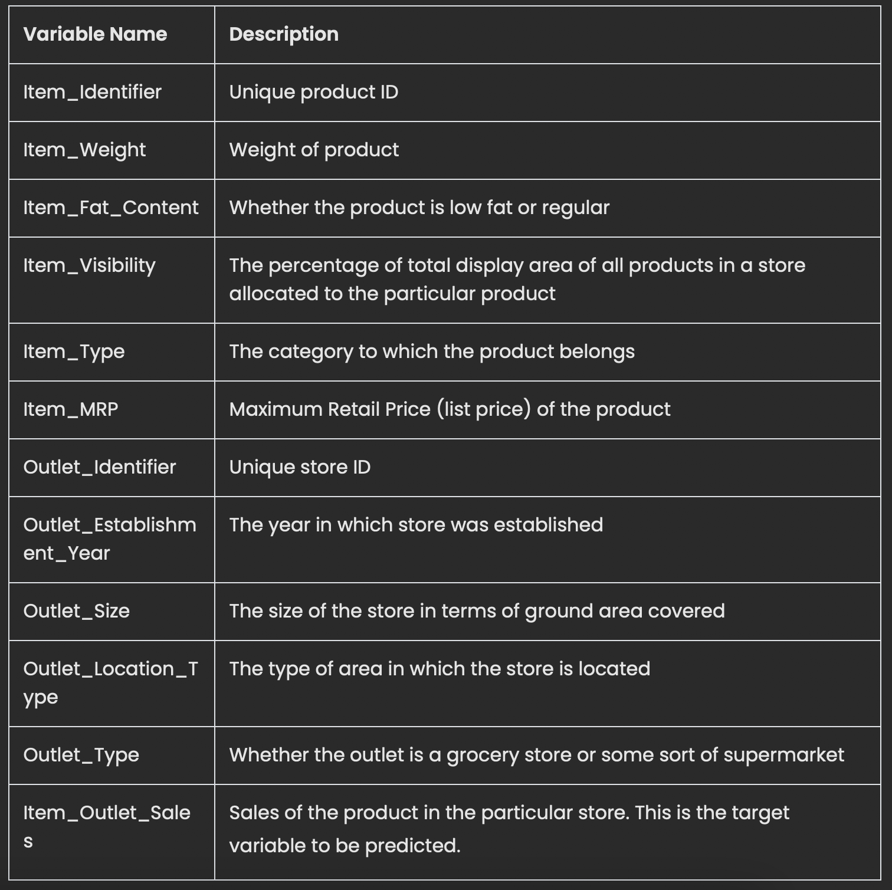

# Food Sales Predictions
Numann Malik

An overview of the project

Finally, we built two a linear regression model and a simple regression tree model on our data set.  The goal of this is to help the retailer understand the properties of products and outlets that play crucial roles in predicting sales.

2 relevant insights from the data (supported with reporting quality visualizations)

Summary of the model and its evaluation metrics

Final recommendations
