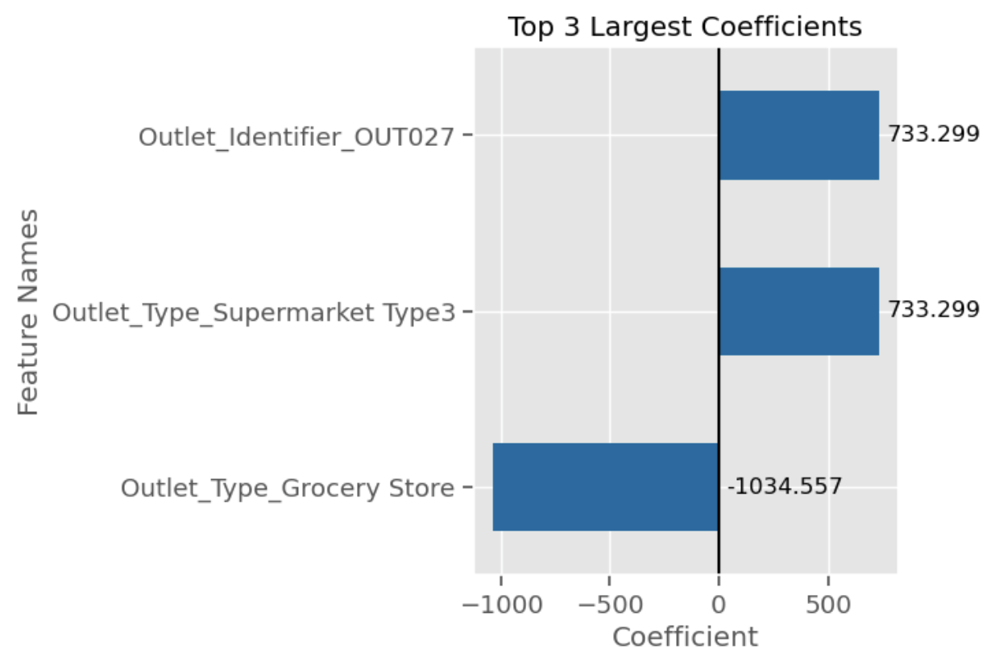
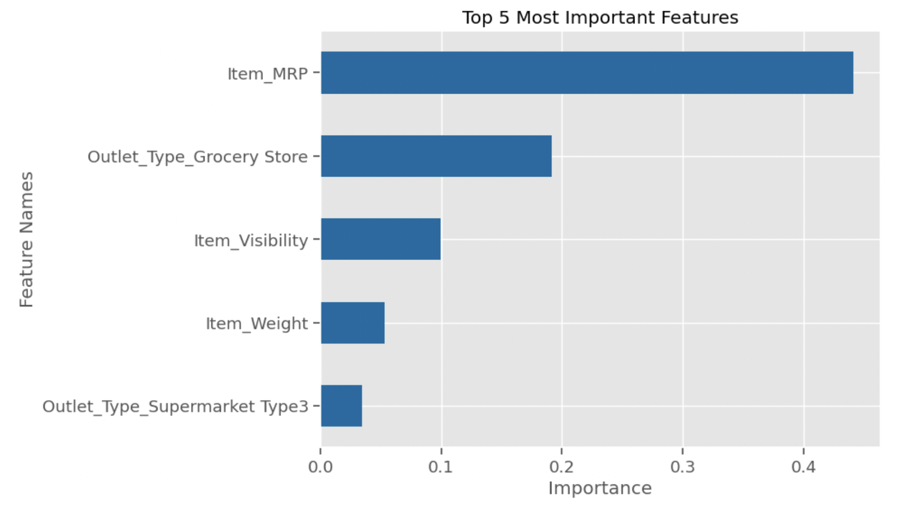
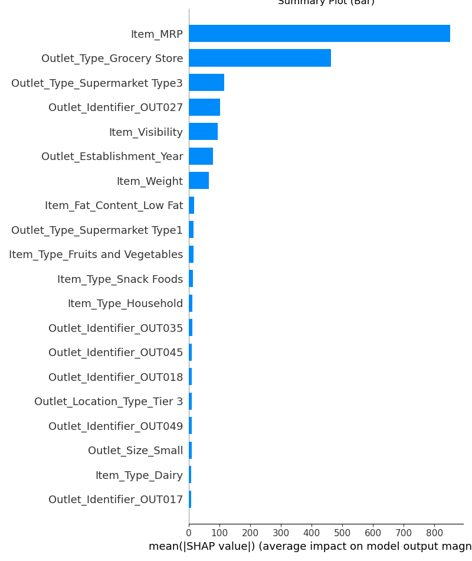
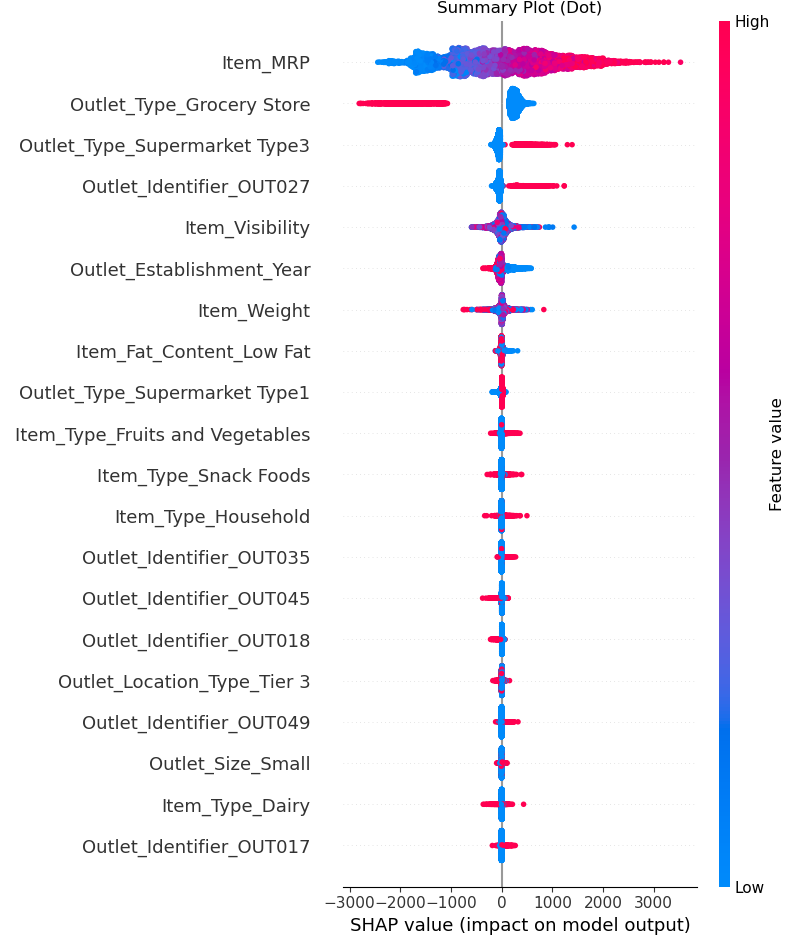
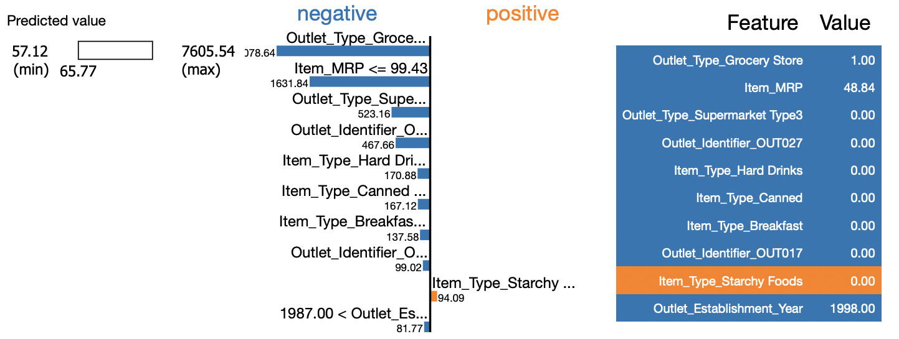
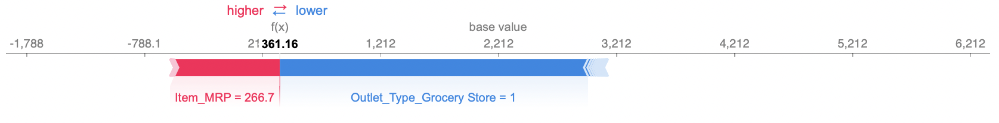
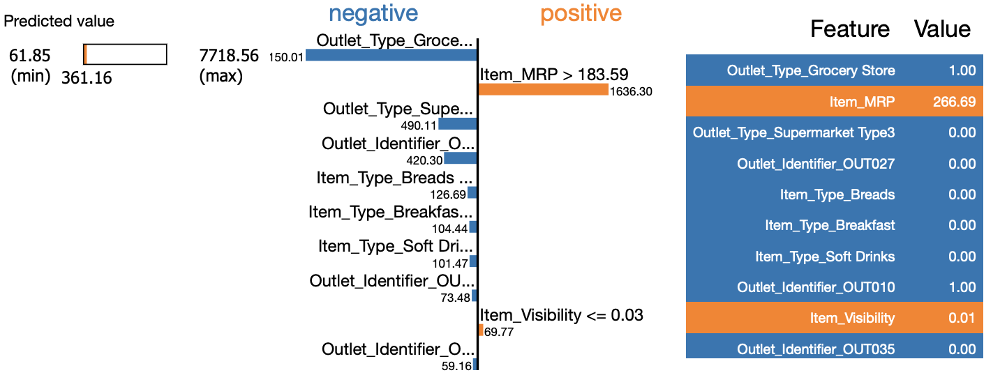
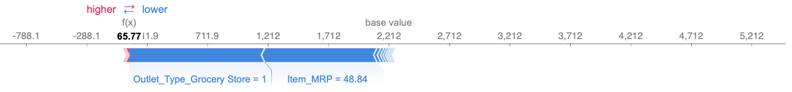

# Sales prediction for food items sold at various stores

Numann Malik

## Objectives

- Our main goal is to help the retailer understand the properties of products and outlets that play crucial roles in increasing sales.
- After cleaning the data we completed statistical analyses that might help us understand, explain, or model with our data. This includes a Histogram to view the distributions of various features in our dataset, aBoxplot to view statistical summaries of various features in our dataset, and a Heatmap of the correlation between features.
- We created several data visualizations to help our stakeholders better understand trends in the data.
- By using machine learning, we help the retailer to make predictions about future sales based on the data provided.
- So we built a linear regression model and a simple regression tree model on our data set. These are to help the retailer understand the properties of products and outlets that play crucial roles in predicting sales.
- Furthermore, we explained (globally and locally) important features using SHAP. This was after computing the coefficients of the linear regression model.

## Data Dictionary

Below is a key for what each column in our data set represents:

## Visual insights from the data

Below are a subset of exploratory and explanatory data visualizations to help us understand any trends in the data:

## Summary of the model and its evaluation metrics

Below we state the R squared and mean squared error scores for our two models:

- Linear Regression Model
 - LR Model Training R2: 0.6712693760364781
 - LR Model Testing R2: -9.996148242813593e+19
 - LR Model Training RMSE: 986.3385424596464
 - LR Model Testing RMSE: 16606970213579.328

- Simple Regression Tree Model:
 - DT Model Training R2: 1.0
 - DT Model Testing R2: 0.21988566762195583
 - DT Model Training RMSE: 4.925864104892086e-15
 - DT Model Testing RMSE: 1467.0779546170936

- Tunded Simple Regression Tree Model:
 - DT Model Training R2: 0.6042066848171654
 - DT Model Testing R2: 0.5960039728227073
 - DT Model Training RMSE: 1082.281287111312
 - DT Model Testing RMSE: 1055.7536944506849
 
## Linear Regression Coefficients Interpretations:

- Intercept: Our model assumed a baseline of 2383
- Products that come from Outlet OUT027 or a Type 3 Supermarket increases sales by 733.3
- Products that come from a Grocery Store decreases sales by 1034.56

## Random Forest Features Importance:

- By far MRP (Maximum retail Price) has the most importance in predicting sales
- This is followed up in second place by products sold in Grocery Stores.
- The next three important features are item visibility, item weight, and products coming out of Type 3 Supermarkets.

## Global Explanations:

Comparing the most important features according to SHAP vs. our original feature importances:
- The top 2 MRP and Grocery Store are the same.
- However Type 3 Supermarket, Outlet OUT027, and Item Visibility, appear to be the next 3 important features according to SHAP.
- While Item Visibility, Item Weight, and Type 3 Supermarket, are the next in our original.

MRP had the largest effect on the model's predictions.

- Because red values are on the right (positive), we can see that the larger the MRP, the more likely the model would predict higher sales.
- We can see that having a higher MRP pushed the model's prediction heavily towards higher sales.

Grocery Stores had the second largest effect on the model's predictions.

- The red values are on the far left (negative) while the blue dots are on the center right, so that if food items were from grocery stores, then the model is much LESS likely to predict higher sales.

Type 3 Supermarket had the third largest effect on the model's predictions.

- The more products were from a type 3 supermarket, the more likely the model would predict higher sales.
- Notice that the blue dots are only slightly to the left of the 0-line, indicating that the model is only slightly less likely to predict lower sales from Type 3 supermarkets.

## Local Explanations:

Two features positively influenced the target sale value:
- High Item_MRP	266.69
- Low Item_Visibility 0.01

Three of the most impactful features that negatively influences the target value:
- It is sold in a grocery store
- It is not sold in a Type 3 supermarket
- It is not sold in Outlet 27

The only feature that positively influenced the target sale value:
- It is not a starchy food

Three of the most impactful features that negatively influences the target value:
- It is sold in a grocery store
- It has a relatively low MRP
- It is not sold in a Type 3 Supermarket

## Final recommendations

- Overall, we recommend the tuned Decision Tree model over Linear Regression due to the improved testing data results (we keep in mind that there is high bias even after tuning the max depth to 5). From the testing R^2 score we see that 59.6% of the 'Item Outlet Sales' variance is explained, with root mean square error of 1055.69.
- MRPs are widely distributed amongst food items. There is one particularly low count around the $70 range.
- Fruits, vegetables, and snack foods dominate in quantity. However, seafood items lie at the bottom of food types, followed by breakfast and starchy foods. Retailers may therefore wish to focus on selling more of the dominant food categories, and fewer on the low end of the ditribution.
- Outlet 27, which is a Tier/Type 3 Supermarket, far outsells the other outlets (most of which are Type 1 supermarkets). Groceries sold far fewer products compared to all types of supermarkets in comparison. The retailer may then want to investigate further to see how Outlet 27 is performing more successfully.
