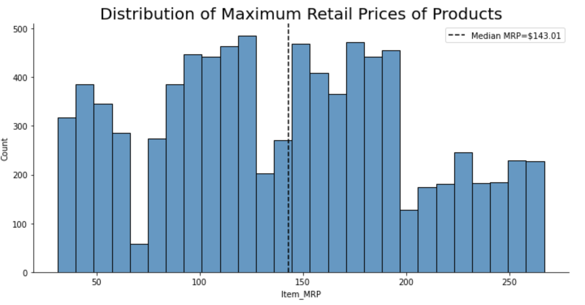
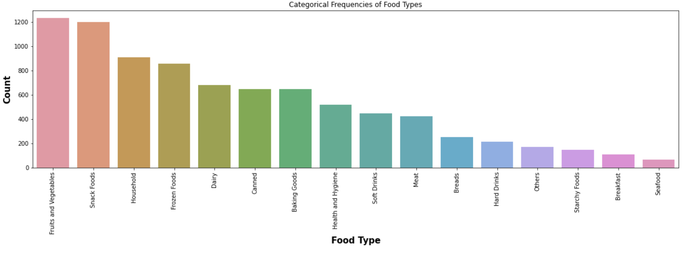

# Sales prediction for food items sold at various stores
Numann Malik

## Goals

- We help the retailer understand the properties of products and outlets that play crucial roles in increasing sales.
- By using machine learning, we help the retailer to make predictions about future sales based on the data provided.
- Finally, we built a linear regression model and a simple regression tree model on our data set. This is to help the retailer understand the properties of products and outlets that play crucial roles in predicting sales.

## Data Dictionary

## Visual insights from the data

## Summary of the model and its evaluation metrics

## Final recommendations

