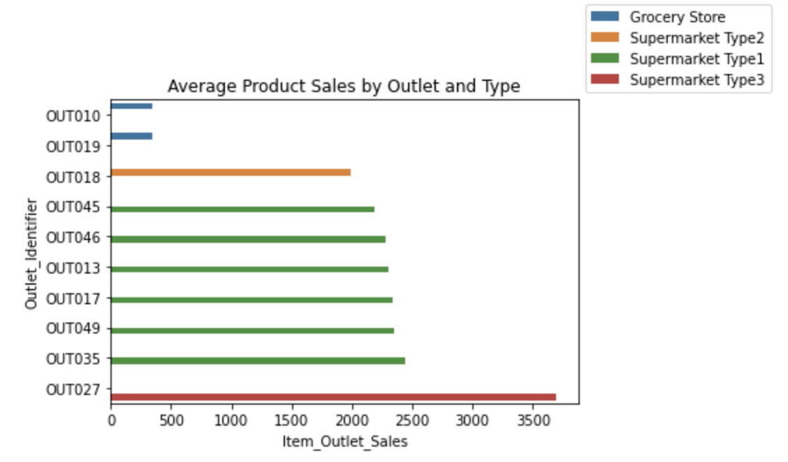

# Sales prediction for food items sold at various stores

Numann Malik

## Objectives

- We help the retailer understand the properties of products and outlets that play crucial roles in increasing sales.
- We completed statistical analyses that might help us understand, explain, or model with our data. This includes a Histogram to view the distributions of various features in our dataset, aBoxplot to view statistical summaries of various features in our dataset, and a Heatmap of the correlation between features.
- By using machine learning, we help the retailer to make predictions about future sales based on the data provided.
- Finally, we built a linear regression model and a simple regression tree model on our data set. These are to help the retailer understand the properties of products and outlets that play crucial roles in predicting sales.

## Data Dictionary

Below is a key for what each column in our data set represents:

## Visual insights from the data

Below are a subset of eploratory and explanatory data visualizations:

## Summary of the model and its evaluation metrics

-

## Final recommendations

-
